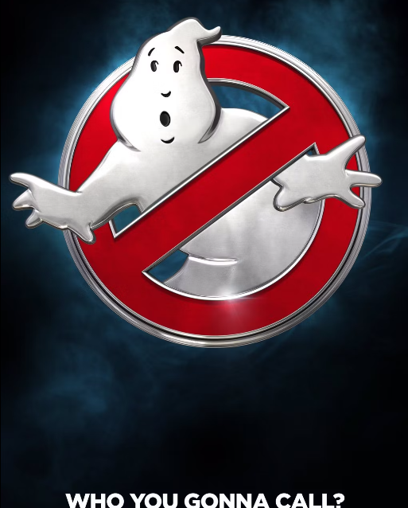
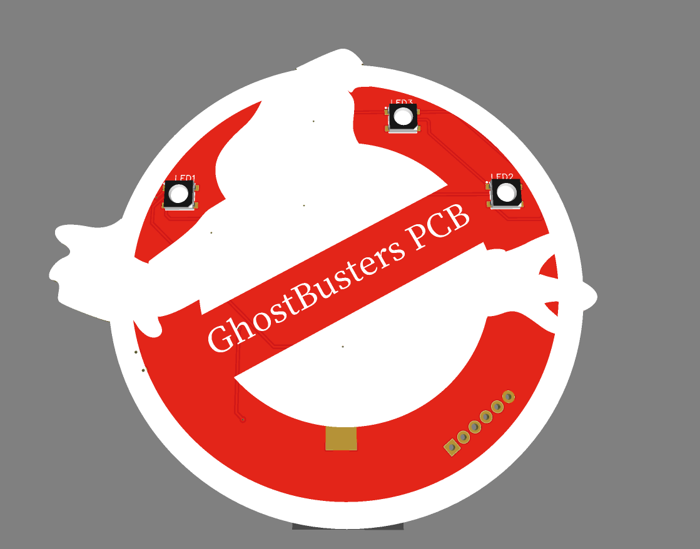
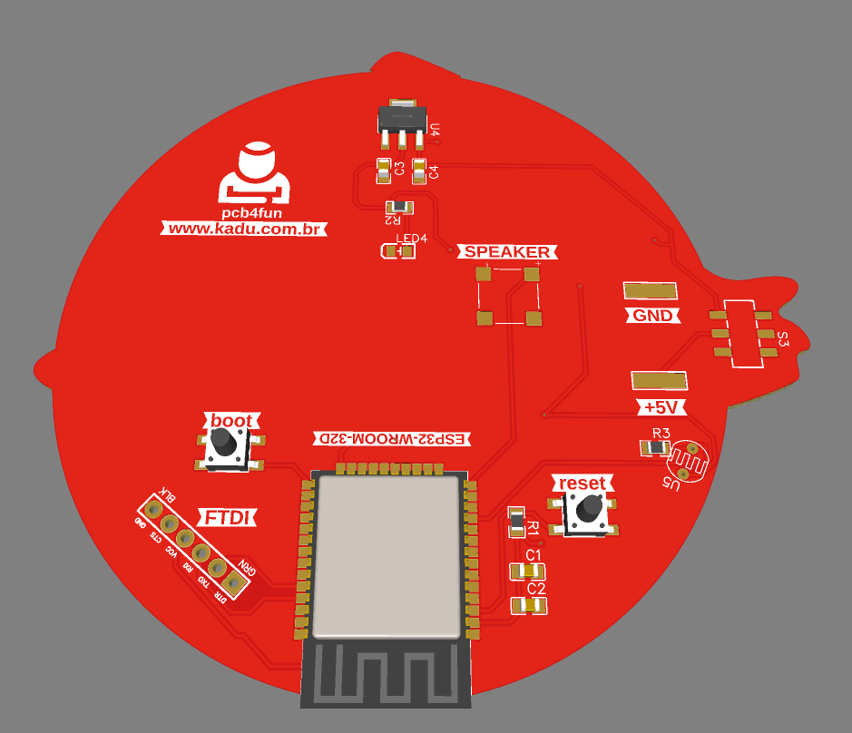

##### Who You Gonna Call?

# GhostBuster

Documentação da PCB do concurso de halloween da JuliaLabs

Um projeto simples porém divertido para participar do concurso de Halloween da JuliaLabs

## Ghostbuster PCB

A idéia é usar a placa vermelha como base e a legenda branca como o "fantasma", além de uma borda pra deixar o vermelho no formato do simbolo dos caças fantasmas.
Nas imagens não da pra perceber, mas também existe as partes que terão o cobre esposto (ou eu gostaria que tivesse) fazendo o contorno do desenho os olhos e a boca. veja as imagens abaixo.
Também coloquei um sensor de luz (ldr) que irá detectar mudanças e será o trigger para tocar musicas no Speaker, e claramente uma delas será o tema do filme :D, mas também terá outras como a clássica do Arquivo X.

https://oshwlab.com/nicodemosbr/fantasma
